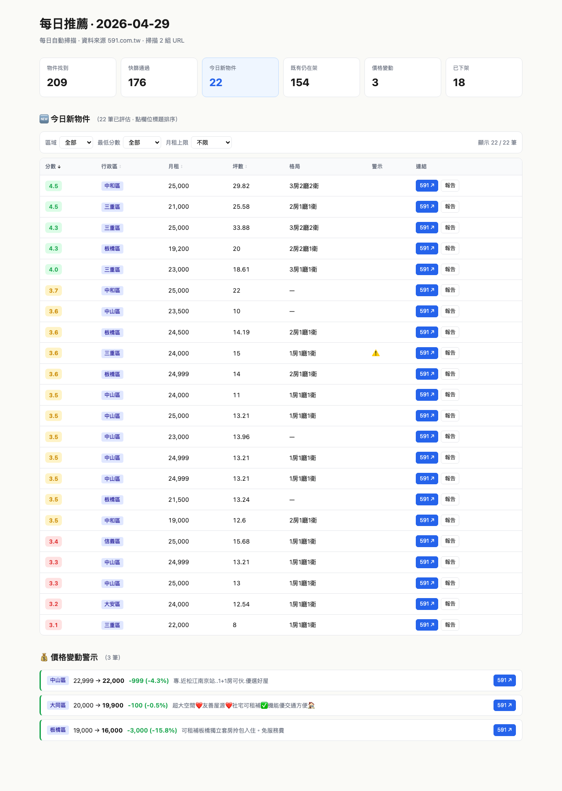
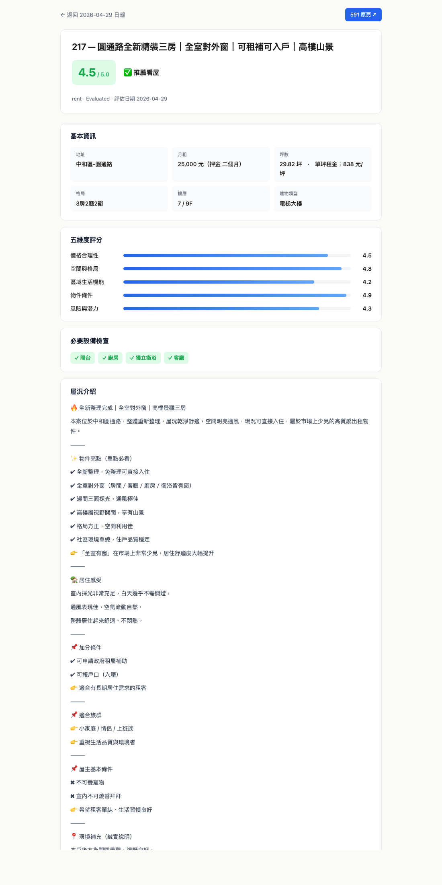

# house-ops

台灣看房 AI 管線，建構於 Claude Code 之上。自動化物件發掘、評估與追蹤，涵蓋租屋與購屋市場的完整搜尋流程。

支援三種使用者類型：**租屋族**、**首購族**、**換屋族**。

**資料來源**：591 全平台 + FB 公開租屋社團（透過 CDP 合成觸控手勢繞過 anti-bot，由 Claude API 從自由格式貼文自動抽取結構化欄位）。

---

## Demo

**每日日報** — 591 上架物件、價格變動、已下架條目；瀏覽器中可排序篩選



**個別物件評估報告** — 五維度評分、基本資訊、屋況介紹、必要設備檢查



---

## 功能概覽

### 自動化（腳本層，可獨立執行）

- **掃描 591** 上架物件並依 `config/profile.yml` 條件初篩（`scan-591.mjs`）
- **掃描 FB 公開租屋社團**（`scan-fb.mjs`）：
  - 透過 CDP `Input.synthesizeScrollGesture` 合成觸控手勢，繞過 FB anti-bot lazy-load 限制
  - 自動把社團排序切換到「New posts」確保抓到最新貼文
  - 點擊「See more」展開摺疊內文
  - 正則粗篩出疑似租屋貼文 → Claude API（haiku 4.5）抽結構化欄位（價格、地址、坪數、房型、聯絡）
- **評估** 從 591 頁面擷取資料後，以五維度啟發式評分（`eval-591.mjs`）：
  - 價格合理性（依單坪租金門檻判斷）
  - 空間與格局（坪數 + 房廳數）
  - 區域生活機能（頁面文字含「捷運」「學區」「市場」等關鍵字加分）
  - 物件條件（電梯、陽台、總樓層、裝潢字樣）
  - 風險與潛力（社宅、deal-breaker 命中、建物類型）
- **追蹤** `data/tracker.md` 結構化表格，搭配 `merge-tracker.mjs` / `dedup-tracker.mjs` / `verify-pipeline.mjs`
- **每日排程** launchd 觸發 `run-daily.mjs`：591 scan + FB scan + eval + 寫日報 (md + html) + email 通知（FB 物件單獨成區塊）

### 互動式 Mode（Claude Code 會話中觸發）

下列 mode 為 Claude prompt 設計，需在 Claude Code 會話中以指令呼叫；非自動化腳本：

- **可負擔房價試算** — `affordability`（`modes/afford.md`，首購族）
- **換屋財務規劃** — `upgrade plan`（`modes/switch.md`，換屋族）
- **看屋清單與議價策略** — `prepare visit for {###}`（`modes/visit.md`）
- **物件比較** — `compare 001, 003`（`modes/compare.md`）
- **批次處理 pipeline** — `pipeline`（`modes/pipeline.md`）

---

## 事前準備

### agent-browser（必裝）

掃描（`scan`）與物件上架驗證依賴 `agent-browser`：

```bash
npm install -g agent-browser
agent-browser --version
```

> 未安裝的情況下執行 `scan` 或貼上 URL，Claude 將無法爬取真實頁面內容，後續評估結果不可信。

### Anthropic API key（FB 整合需要）

FB 社團貼文是自由格式文字，需要 Claude API 抽取結構化欄位（每篇成本約 USD 0.001）。**只用 591 不需此 key**。

到 <https://console.anthropic.com> 申請 → 加值（USD 5 起跳即可跑很久） → 把 key 寫入 `~/Library/LaunchAgents/com.house-ops.daily.plist` 的 `EnvironmentVariables` 區塊（範本見 `launchd/com.house-ops.daily.plist.example`）。

未設此 key 時 FB scan 會 fallback 為「只寫原文到 pipeline.md，不做結構化」，整體 daily 流程不會 fail。

---

## 快速開始

1. 安裝 `agent-browser`（見上方）
2. Clone 此 repo 並在 Claude Code 中開啟
3. Claude 會自動偵測缺少的設定檔，啟動初始設定流程
4. 設定完成後，貼上任何物件 URL 即可評估——或輸入 `scan` 搜尋目標區域

---

## 用法

| 輸入 | 動作 |
|------|------|
| 貼上物件 URL | 自動判斷租屋 / 買屋 → 評估 → 產生報告 |
| `scan` | 在目標區域掃描 591 的新物件 |
| `pipeline` | 批次處理 `data/pipeline.md` 中所有待評估 URL |
| `compare 001, 003` | 並列比較兩間已評估物件 |
| `prepare visit for 001` | 產生報告 001 的看屋清單與議價策略 |
| `affordability` | 試算可負擔房價與區域適配（首購族） |
| `upgrade plan` | 換屋財務規劃：賣舊屋 + 買新房時程與資金缺口分析（換屋族） |
| `tracker` | 顯示所有追蹤物件的摘要 |

---

## 評分標準

物件依五個維度評分 0–5：

| 維度 | 租屋權重 | 買屋權重 |
|------|----------|----------|
| 價格合理性 | 30% | 35% |
| 空間與格局 | 20% | 20% |
| 區域生活機能 | 25% | 20% |
| 物件條件 | 15% | 15% |
| 風險與潛力 | 10% | 10% |

分數判讀：≥4.0 → 推薦看屋　·　3.5–3.9 → 持保留態度　·　<3.5 → 建議跳過

---

## 追蹤表狀態

`Scanned` → `Evaluated` → `Visit` → `Visited` → `Offer` → `Negotiating` → `Signed` → `Done`

另有：`Skip`（篩除）、`Pass`（看後放棄）、`Expired`（物件已下架）

---

## 資料合約

**使用者層**（永遠不會被自動覆寫）：`config/profile.yml`、`modes/_profile.md`、`data/*`、`reports/*`

**系統層**（可能隨系統更新）：所有 mode 檔案、`CLAUDE.md`、`*.mjs` 腳本、`templates/*`

---

## 腳本

```bash
# 日常
node scripts/scan-591.mjs         # 爬蟲：依 profile.yml 條件掃 591
node scripts/scan-fb.mjs          # 爬蟲：依 portals.yml 掃 FB 公開社團，LLM 抽結構化欄位
node scripts/eval-591.mjs --from-pipeline 10   # 評估 pipeline 前 10 筆（同步產 .md + .html）
node scripts/rank-listings.mjs --rewrite       # Phase 1.5 排序重寫 pipeline.md
node scripts/run-daily.mjs        # 🌅 一鍵跑：scan 591 + FB → eval 今日新 → 寫日報 (md + html) → 寄 email

# 維護
node scripts/convert-reports-html.mjs  # 批次將 reports/*.md 轉成 .html（個別物件報告）
node merge-tracker.mjs           # 合併待新增 TSV 至 tracker.md
node verify-pipeline.mjs         # 檢查 pipeline 完整性
node dedup-tracker.mjs           # 移除重複追蹤條目
node --test tests/**/*.test.mjs  # 執行所有測試
```

報告檔案類型：
- `reports/NNN-*.md` — 個別物件評估報告（canonical 原始檔，git 追蹤）
- `reports/NNN-*.html` — 對應的美化檢視頁面（.md 自動渲染，gitignore）
- `reports/daily/YYYY-MM-DD.md` + `.html` — 每日彙總，html 支援排序 / 篩選

---

## 自動排程（macOS launchd）

每天固定時間自動跑 `run-daily.mjs`，產 `reports/daily/YYYY-MM-DD.md`。

### 安裝步驟

1. 編輯 `launchd/com.house-ops.daily.plist.example`，把 `YOUR_USERNAME` 換成你的 macOS 使用者名稱（`whoami` 查詢），如需調整執行時間改 `StartCalendarInterval` 的 Hour / Minute（預設每日 09:00）。

2. 複製到使用者 LaunchAgents：
   ```bash
   cp launchd/com.house-ops.daily.plist.example ~/Library/LaunchAgents/com.house-ops.daily.plist
   ```

3. 載入並啟動：
   ```bash
   launchctl bootstrap gui/$(id -u) ~/Library/LaunchAgents/com.house-ops.daily.plist
   launchctl start com.house-ops.daily   # 立即手動觸發一次做測試
   ```

4. 確認已註冊：
   ```bash
   launchctl list | grep house-ops
   tail -f data/logs/daily.out.log       # 看每次跑的 stdout
   ls reports/daily/                     # 看每日日報
   ```

### Mac 熟睡解方

launchd 只在 Mac 醒著時觸發。若你的 Mac 夜間熟睡，可設定自動喚醒：

```bash
# 工作日 08:55 自動喚醒（09:00 跑完會自行進入睡眠）
sudo pmset repeat wakeorpoweron MTWRF 08:55:00
```

### Email 通知（選用）

跑完 daily 之後可自動把日報寄到信箱，避免漏看。本機透過 Gmail SMTP（nodemailer）寄送，需要 Gmail App Password。

設定步驟詳見 [`docs/email-setup.md`](docs/email-setup.md)，重點：

1. 到 <https://myaccount.google.com/apppasswords> 產一組 16 字元 App Password
2. 在 `~/Library/LaunchAgents/com.house-ops.daily.plist` 的 `EnvironmentVariables` 區塊加入 `GMAIL_USER`、`GMAIL_APP_PASSWORD`、`NOTIFY_EMAIL_TO`
3. `launchctl unload && launchctl load` 重載
4. 馬上測試：`node scripts/run-daily.mjs --email-only`

未設定環境變數時 daily run 仍正常完成，只是跳過寄信並顯示 `⚠ Email 跳過：缺少環境變數`。

寄出信件內容包含：今日新物件表格（分數 / 行政區 / 月租 / 坪數 / 格局 / 警示 / 591 連結）、價格變動、已下架條目、各區統計。詳細個別報告請至本機 `reports/` 目錄查看。

### CLI Flags

`scripts/run-daily.mjs` 支援以下 flag：

| Flag | 行為 |
|---|---|
| (預設) | 完整 scan + eval + 渲染 + 寄信 |
| `--dry-run` | 只重新渲染今日日報，不 scan、不寄信 |
| `--email-only` | 重新渲染今日日報並寄信，不 scan |
| `--no-email` | 完整 scan + eval + 渲染，但不寄信 |

`--dry-run` 與 `--email-only` 用 `data/last-scan.json`（前一次真跑的快取）+ 現有 `reports/NNN-*-YYYY-MM-DD.md` 重建 `reports/daily/YYYY-MM-DD.{md,html}`，不觸發 scan、不改 `scan-history.tsv`、不產新的個別報告。第一次使用前必須先有一次真跑以產生快取。

### 解除安裝

```bash
launchctl bootout gui/$(id -u) ~/Library/LaunchAgents/com.house-ops.daily.plist
rm ~/Library/LaunchAgents/com.house-ops.daily.plist
```

---

## FB 公開社團整合

每天自動掃 FB 公開租屋社團最新貼文，抽出結構化欄位後與 591 一起評估。

### 為什麼這樣做

- Facebook Graph API 已於 2024-04 完全 deprecate Groups API，不存在合法 API 路徑
- 純 JS scroll、`agent-browser scroll`、keyboard PageDown、CDP `Input.dispatchMouseEvent` 都被 FB anti-bot 偵測，feed 不會 paginate
- 唯一可行的繞過方式：**CDP `Input.synthesizeScrollGesture`**（合成觸控手勢，FB 視為實體 trackpad 滾動）
- 由 `lib/cdp-scroll.mjs` 直接連 Chrome DevTools WebSocket 觸發，不過 agent-browser

### 安裝步驟

1. **配置社團**：編輯 `portals.yml`，新增條目（範本見 `portals.example.yml`）：
   ```yaml
   tracked_portals:
     - name: "FB 台北租屋社團"
       type: rent
       enabled: true
       source: facebook_group
       group_url: "https://www.facebook.com/groups/{group_id}/"
       group_id: "{group_id}"
       scroll_rounds: 20    # 每輪約捲 900px，20 輪約 18000px 抓到 30+ 篇貼文
   ```

2. **啟動專用 Chrome 實例**（與你日常 Chrome 完全隔離，避免互相干擾）：
   ```bash
   cp launchd/com.house-ops.chrome-debug.plist.example ~/Library/LaunchAgents/com.house-ops.chrome-debug.plist
   # 編輯該檔，把 YOUR_USERNAME 換成你的 macOS 使用者名稱
   launchctl load -w ~/Library/LaunchAgents/com.house-ops.chrome-debug.plist
   ```

   plist 設定 `RunAtLoad: true` + `KeepAlive: true`，Chrome 會在開機時自動啟動，當機也會自動重啟。專用 profile 路徑為 `.chrome-profile/`（已 gitignore）。

3. **首次手動登入 FB**（一次性，cookie 持久化）：
   - 自動跳出的 Chrome 視窗中，打開 `https://facebook.com` 登入
   - 加入目標社團（公開社團也要先按「加入」才能看完整內容）
   - 之後 launchd 重啟也不用再登入

4. **加 ANTHROPIC_API_KEY**：見上方「事前準備」section。

5. **驗證**：
   ```bash
   curl -s http://localhost:9222/json/version | head -c 200   # CDP 在聽
   export ANTHROPIC_API_KEY=$(plutil -extract EnvironmentVariables.ANTHROPIC_API_KEY raw ~/Library/LaunchAgents/com.house-ops.daily.plist)
   node scripts/scan-fb.mjs                                    # 端對端 dry run
   ```

### Pipeline 流程

```
[role="feed"] → 排序切換為 "New posts"（CDP 點擊 + 等渲染）
   ↓
CDP synthesizeScrollGesture × N 輪（每輪 900px，wait 2.2s 給 FB 渲染）
   ↓
EXTRACT_JS：每張貼文卡片用 [data-ad-preview="message"] 拿主文字（自動排除留言）
   ↓
正則粗篩（含「月租 / 押金 / 4-5 位數字」+ 排除「#求租」hashtag）
   ↓
Claude haiku 4.5 抽 { price_num, address, district, size, layout, contact, confidence }
   ↓
profile.yml Phase 1 過濾 → pipeline.md (## FB Pending) + scan-history.tsv (source=facebook)
```

### 限制與已知行為

- **無真 permalink**：FB 在 New posts 排序下不在卡片內提供 `/posts/` 連結，pseudo permalink 用 `#post-{user_id}-{text_hash}` 作為 dedup key；點擊回到社團首頁而非單篇貼文
- **覆蓋率非 100%**：FB 演算法本身就會隱藏部分貼文，連手動瀏覽也看不全
- **Anti-bot 軍備競賽**：FB 隨時可能識破合成手勢，到時須換手段（如 puppeteer-extra-stealth、Bright Data）
- **違反 FB ToS**：自動化抓取違反 Terms of Service §3.2.3，請斟酌使用；若你的 FB 帳號被風控，請降低 `scroll_rounds` 或擴大每天觸發間隔
- **單篇貼文評估**：使用者貼 `facebook.com/groups/.../posts/...` URL 給 Claude 時走 `modes/fb-eval.md` 流程，但 FB 在某些排序下不提供穩定 permalink，single-post URL 可能無法 reliably 開啟

---

## 修改搜尋條件

所有條件集中在 **`config/profile.yml`**，修改後不必動 code：

| 欄位 | 影響 |
|---|---|
| `budget.rent_max` | 月租上限 |
| `property.size_min` | 最小坪數 |
| `regions[].city` + `districts` | 搜尋縣市與行政區（可多城市、多區）|
| `narrative.deal_breakers` | 標題命中直接排除 |
| `narrative.required_features` | Phase 2 評估時檢查必備設備 |

`config/591-sections.yml` 是系統層（591 的 region/section 代碼對照表），除非 591 改變編碼否則不用動。

---

## 使用原則

本系統以精準找房為目標，非大量瀏覽。Claude 不會代替你送出 offer、簽約或送出任何申請。評分低於 3.5/5 的物件將被明確建議不值得追蹤。
